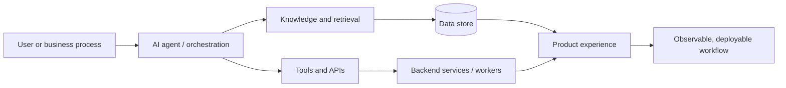

  

# AI Automation & Agent Developer

**I build AI systems that connect models, business data, APIs, and dependable software workflows.**

`AI agents` · `RAG` · `Voice AI` · `Python` · `FastAPI` · `LangChain` · `full-stack AI SaaS`

[Explore projects](#featured-systems) · [Engineering activity](#engineering-activity) · [GitHub](https://github.com/bvbvbv54)

## Systems I Build

| Area | From capability to product |
| --- | --- |
| **AI agents & workflows** | Tool-aware systems that coordinate APIs, data, and repeatable business steps. |
| **RAG & knowledge systems** | Retrieval and evidence paths that give language models relevant context. |
| **AI research automation** | Data collection, scoring, classification, reporting, and human-visible controls. |
| **AI-enabled SaaS** | Backend services, workers, databases, interfaces, and deployment-aware architecture. |

## Current Focus

- Building production-minded agent and automation workflows around real APIs and data.
- Improving retrieval quality, evidence capture, and evaluation paths for AI systems.
- Designing Python services and worker-based pipelines that can pause, resume, and recover.
- Delivering practical AI product surfaces rather than isolated model demos.

## Engineering Stack

**AI systems**

   

**Backend & automation**

  

   

**Data & infrastructure**

  

*The stack above is limited to technology supported by the public Aurora repository and this profile package; other projects may add technologies after their public documentation is reviewed.*

## Featured Systems

### [Aurora](https://github.com/bvbvbv54/Aurora) — evidence-first research automation

`Python` `SQLite` `browser automation` `AI classification` `Docker`

A resumable YouTube keyword-research pipeline that collects observable evidence, classifies visual inputs, scores opportunities, and produces reports. Its architecture includes persisted stages, a supervised browser-worker fleet, checkpoints, bounded retries, and explicit degraded-mode behavior—an example of automation built as an operating system, not a one-off script.

### [TeleMedia AI](https://github.com/bvbvbv54/TeleMedia-AI) — AI social-media automation showcase

`AI automation` `SaaS` `workflows`

A public project archive/showcase for an AI social-media automation SaaS. The active implementation is maintained privately; this profile intentionally does not represent the public repository as the complete runnable SaaS.

### [MarketForge AI](https://github.com/bvbvbv54/MarketForge-AI) — AI commerce intelligence

`AI product` `commerce intelligence` `automation`

An AI commerce-intelligence project selected for its product and automation positioning. Its public README should remain the source of truth for stack and implementation details; this summary deliberately avoids claims not verified in the repository documentation during this profile build.

## How I Think About AI Systems

A useful AI feature needs more than a model call: grounded context, controlled tools, durable state, and an application path that people can operate.

## Engineering Activity

  

The skyline is generated from GitHub contribution data by a scheduled workflow in this repository. It is refreshed weekly and can be regenerated on demand. The native GitHub contribution calendar remains untouched.

## Let's Build

If you need an AI agent, retrieval-backed knowledge system, workflow automation, or an AI product that connects to real services and data, explore the projects above or reach me through [GitHub](https://github.com/bvbvbv54).

