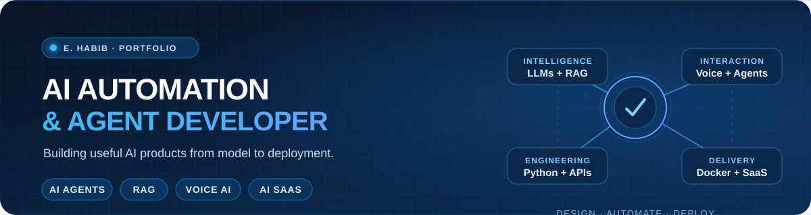
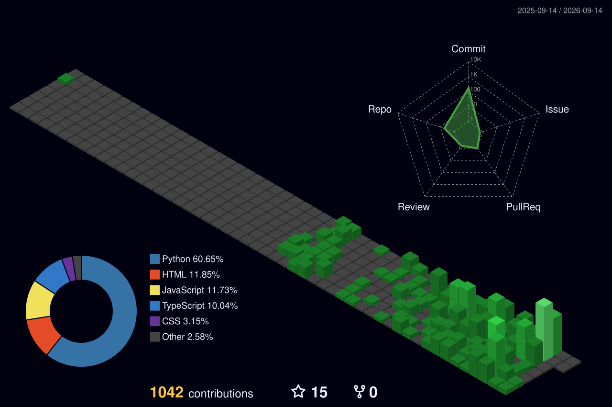

  

# 👋 Hi, I'm E. Habib

## 🤖 AI Automation & Agent Developer

**AI Agents · RAG · Voice AI · Python · FastAPI · LangChain · AI SaaS**

I build practical AI-powered applications and automation products with Python, APIs, databases, web interfaces, and Docker. My work focuses on turning useful AI capabilities into software people can actually use.

## 👨‍💻 About Me

- 🔭 Building AI-powered SaaS and automation projects.
- 🤖 Focused on AI agents, RAG applications, Voice AI, and LLM integrations.
- 🐍 Building backend services and APIs mainly with Python and FastAPI.
- 🌐 Comfortable working across backend, databases, frontend, workers, and Docker.
- 🚀 Interested in turning repetitive business processes into useful AI software.

## 🚀 What I Build

- 🤖 **AI Agents** — assistants that use tools, APIs, databases, and business workflows.
- 🔎 **RAG Applications** — AI assistants grounded in documents, private knowledge, and search.
- 🎙️ **Voice AI** — voice applications combining speech-to-text, LLMs, tools, and text-to-speech.
- ⚙️ **AI Automation** — workflows for content, research, data processing, and business operations.
- 🌐 **AI SaaS Products** — full-stack products combining AI features, backend services, databases, and deployment.

## 🧰 Tech Toolbox

### AI & Automation

     

### Languages & Frameworks

      

### Data & Infrastructure

    

## 🔥 Featured Projects

### 📺 TeleMedia — AI Social Media Automation SaaS

**Tech:** AI automation · Python · APIs · TTS · media workflows · Docker

AI-powered social media automation platform designed to automate content generation, media processing, scheduling, and publishing workflows across multiple platforms. The system combines AI generation, voice/media processing, APIs, scheduling, backend services, databases, and containerized infrastructure.

The public repository contains the project showcase; the active application is maintained privately.

[🔗 View TeleMedia AI](https://github.com/bvbvbv54/TeleMedia-AI)

### 🔎 Aurora — AI-Powered Research Automation

**Tech:** Python · AI · browser automation · SQLite · Docker

Python-based research automation platform that collects and analyzes YouTube search data to identify content opportunities using evidence, scoring, and AI-assisted classification. It includes resumable workers, browser automation, SQLite persistence, reporting, and failure recovery.

[🔗 View Aurora](https://github.com/bvbvbv54/Aurora)

### 🛒 MarketForge AI — AI Commerce Intelligence Platform

**Tech:** Python · FastAPI · Next.js · PostgreSQL · Redis · Docker

AI-powered commerce platform designed to help sellers research products, analyze opportunities, generate product content, plan AI visuals, and prepare marketplace-ready product packages. It demonstrates AI automation, backend services, a modern web dashboard, background processing, and structured product-intelligence workflows.

[🔗 View MarketForge AI](https://github.com/bvbvbv54/MarketForge-AI)

## 🌐 Let's Connect

- [GitHub](https://github.com/bvbvbv54)
- [Upwork](https://www.upwork.com/freelancers/~01bc2f92b57edf3b9d)
- [MAD Automotives](https://github.com/MAD-AUTOMOTIVES)

Open to AI automation, agent, RAG, Voice AI, AI SaaS, and backend/API projects.

## Engineering Activity

  

The skyline is generated from GitHub contribution data by a scheduled workflow in this repository. It is refreshed weekly and can be regenerated on demand. The native GitHub contribution calendar remains untouched.
